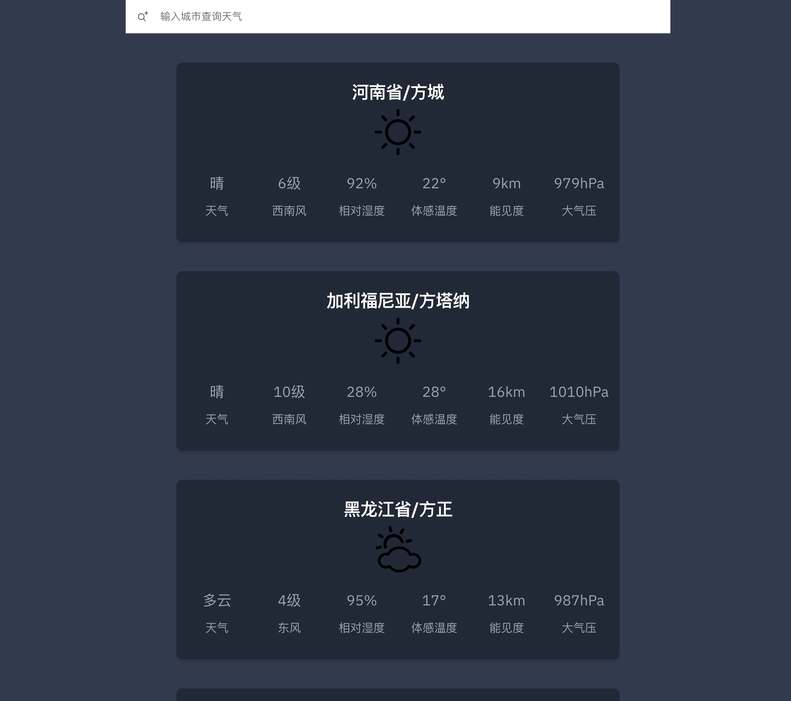

## Technology Stack

svelte + vite + axios + flowbite + carbon-components + ts

## Effect



## create your apikey

https://dev.qweather.com/docs/configuration/project-and-key/


```bash
cd src; touch .config.ts;
```

in your .config.ts file , fill in this code

```js
export default{
    apikey:'Your-Api-Key'
}
```

## Developing

Once you've created a project and installed dependencies with `npm install` (or `pnpm install` or `yarn`), start a development server:

```bash
npm run dev

# or start the server and open the app in a new browser tab
npm run dev -- --open
```

## Building

To create a production version of your app:

```bash
npm run build
```